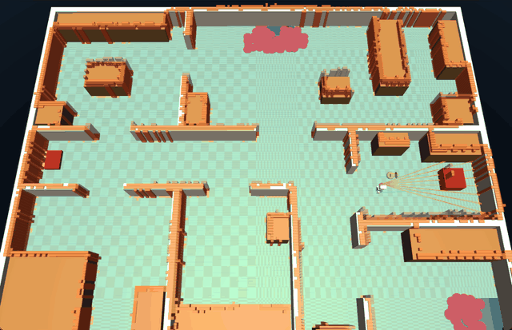

# quack-nav

Navigation for the [Microduck](https://pollen-robotics.com/microduck/):
where the duck is, and how it gets somewhere else.

A daemon (`quack-navd`) and the library under it. It hosts the mapper
itself — `maploc`, in this workspace, derived from Pollen's (upstream PR
127) — against Pollen's **released** robotd, and adds everything above it: a cliff guard that judges the 8×8 depth sensor's
downward beams against the floor, a costmap planner, a registry of
places people taught it, an explorer that maps a house on its own, a
homecoming that recognises the house at boot — and a *paper twin* that
runs all of it against a kinematic model of the duck, thousands of
times an hour, so a rule is measured before it is believed.



*A `go_to` on the MuJoCo twin, casa_grande, on the map the duck explored
itself: 5.2 m in a straight line from the far bedroom to the kitchen,
walked in 123 s and shown 6× faster. The dotted line is the path walked,
the line ahead of the duck the planned route, the red blobs the drops it
booked (2026-10-01).*

Independent project, not affiliated with Pollen Robotics. Apache-2.0.
Split out of [quacksat](https://github.com/andreagenovese/quacksat) on
2026-09-22 (ADR 0006), with the history of every measurement that made
it. quacksat is now the voice front end only: it relays the user's spoken
commands to quack-nav's tools and does no navigation.

> **An experiment — take it with a pinch of salt.** Everything here has
> run on the MuJoCo and paper twins only, never on a physical duck. A
> walking robot near stairs can fall and break: if you try it on real
> hardware, keep it away from drops and stay beside it. The numbers in
> [docs/results.md](docs/results.md) are what the twin measured, not a
> promise of what a real house will do.
>
> Every move quack-nav sends — `robot.move` and `robot.map_step`
> included — stops at a drop the depth sensor sees ahead (forward moves
> only). **Pollen's own teleop (the gamepad, the console) does not go
> through quack-nav, and robotd has no drop protection of its own**:
> driven that way the duck walks off a stair as onto the floor (an ask
> upstream, [docs/study/upstream-asks.md §8](docs/study/upstream-asks.md)).
> Driving it around by hand does not lose its position: walking explains
> the motion; only a carry, a sit or a fall makes it look for itself.

Current release: **v0.2.0-rc2**, a release candidate validated on the twins —
[release notes](docs/release-notes-v0.2.0-rc2.md) (rc1: [notes](docs/release-notes-v0.2.0-rc1.md)), [changelog](CHANGELOG.md).

## What it is for

A duck that knows where it is can be told where to go. `quack-navd`
answers for that on a unix socket, in robotd's own dialect — NDJSON,
JSON-RPC 2.0 — so anything can drive it: a voice satellite, an agent,
a ROS bridge, a shell script.

```sh
# the catalog it announces
printf '{"jsonrpc":"2.0","id":1,"method":"nav.catalog","params":{}}\n' | nc -U /run/quack-nav/nav.sock

# where am I?
printf '{"jsonrpc":"2.0","id":2,"method":"nav.call","params":{"name":"robot.where_am_i","args":{}}}\n' | nc -U /run/quack-nav/nav.sock

# map the house, then go to the kitchen
… {"name":"robot.map_explore","args":{}}
… {"name":"robot.go_to","args":{"place":"kitchen"}}
```

Twelve tools: `robot.where_am_i`, `robot.remember_place`,
`robot.forget_place`, `robot.list_places`, `robot.map_status`,
`robot.map_step`, `robot.map_explore`, `robot.go_to`, `robot.map_save`,
`robot.map_list`, `robot.map_load`, `robot.map_match` — each with a
JSON-Schema parameter list, ready to be projected onto OpenAI tools or
MCP by whoever hosts them.

## Using it

What a user can ask of the duck, through a voice satellite or anything
that speaks the socket:

- **"Explore the house."** Exploring is progressive: one session per charge
  (a time budget, or the battery under 25 %), each going on from where the
  last one stopped and saving the map at its end. After the next charge the
  duck finds the map, finds itself on it and explores on (`[homecoming]
  resume_explore`), until nothing large is left — then the house is done.
- **"How far along is the map?"** `robot.map_status` → `house.percent_mapped`,
  the sessions so far, done or not.
- **"Exploration complete."** The user closes the map as it is
  (`map_explore complete`): saved, declared done, frozen.
- **A new map.** `map_explore fresh` answers what would be lost and waits for
  `confirmed`; the saved map is replaced only when the new one's first
  session saves.
- **Going places.** On a finished map the duck explores no more, even after a
  restart: it comes home, freezes the map (as it loads it, with or without
  `resume_explore`) and navigates — blind where the map knows the floor, with
  the guard on where it does not. `robot.go_to` a named
  place or a point; `robot.remember_place` names where it stands.
- **When it moves on its own.** After a power-on the duck may walk by
  itself — looking for where it is on the saved map, exploring to recognise
  the house, finding itself again before a job after it was moved. Allowed,
  but said: `robot.map_status` → `explore.self_started` and the reason
  (`explore.state` `searching` at boot), a warning in the log, a hint.
  **STOP** — `robot.go_to {"stop": true}`, quack-control's button — stops
  it at once and holds: nothing starts it again by itself in that power-on
  until a job is asked for. A `robot.move` or `robot.map_step` while it
  moves on its own stops that motion and obeys (the reply's `stopped_own`);
  after a STOP both work at once — on a lost or untrusted pose judged by
  the depth sensor alone, `robot.move`'s cliff guard on.

The design is ADR 0008.

## The crates

- **`quack-duck`** — robotd's lane (a JSON-RPC client over its unix
  socket), the gait's limits, the body's own commands. A client of the
  duck, nothing more; the satellite uses it too.
- **`quack-nav`** — the map client, the cliff guard, the planner, the
  places registry, the explorer, the homecoming, the tools, the paper
  twin, and `quack-navd`.

## What has been measured

**[`docs/results.md`](docs/results.md)** has the release's numbers, the
criteria they are held to and the known limits. In short, on the MuJoCo twin
with three houses: no fall in 11 exploration sessions and 51 journeys; 90 %
of journeys arrived (`main`'s build, same maps: 63 %); every confirmed pose
within 20 cm of the truth; 5 of 7 release criteria met, counting partials as
half.

Before that, three weeks on the twin, written down as it happened in
[`docs/todo-map.md`](docs/todo-map.md) (Italian copy beside it) and
[`docs/study/baseline-twin.md`](docs/study/baseline-twin.md). The
shape of it:

- **Blind journeys on a saved map**: six goals round a flat, 6/6, about
  eight minutes, no fall — run after run since 2026-09-16.
- **The boot**: the duck wakes up where it was carried, recognises the
  house it saved and confirms its pose. On the wake bench (2026-09-30,
  12 spawns across two houses, then the same turned 180°): 23 of 24
  right, none wrong, no fall; medians 87–105 s, and 105–123 s turned
  (174–192 s and 126–135 s before the shadow map).
- **A house never used to tune anything** (casa_grande, 2026-09-30:
  seven rooms, a corridor turning 90°, two holes): 16/16 journeys, 8/8
  wakes (median 84 s), no fall, walls 99 % on the truth.
- **The stairwell**: the passage beside a hole, 0.54 m wide, walked
  with the guards on when the pose is within 10 cm — and why it is the
  pose, not the rules, that decides (the scan matcher lags 8–10 cm
  along a corridor; measured, not guessed).
- **Long idle stands** (2026-10-01): after a minute with no job the
  mapper rests — odometry carries the pose, one window a head sweep long
  is judged against the map every two minutes, nothing is corrected — and
  a job, a move or a push wakes it on its first tick (a `go_to`: 0.12 s).
  Over thirty-minute stands on the twin, whose standing duck turns and
  slides by itself, the pose stayed 5.5-7.9 cm from the truth on average,
  about what staying awake gives, for less CPU. Moved while it rested — a
  watch the map contradicts, a push, a sit — the pose is untrusted, and
  the next `go_to` walks and looks until it finds where it is before it
  sets out (carried 3.3 m into another room: found in 70 s, arrived 2 cm
  off).
- **Things on the floor**: a 7 cm cube beside a blind leg is seen and
  gone round; under ~9 cm the sensor's own floor threshold loses it
  while walking.

## The paper twin

`quack-nav/examples/paper_twin.rs` is the explorer run against a
kinematic model of the duck in a flat of boxes: the real planner, the
real guards, the real job — with the gait, the depth sensor and the
pose's drift modelled from what the MuJoCo twin measured. Thirty trials
take a minute:

```sh
cargo run --release --example paper_twin -- \
    quack-nav/examples/apartment.world.json /tmp/out --runs 30 --goto -2.64,-2.12 --books
```

`--known` freezes the world as the map (the journey bench), `--bias
dx,dy` offsets the map's frame from the world (what a real pose error
does to a passage).

## The pilot (experimental, branch `rl-nav`)

A small network that picks the stick's moves from the route ahead, the
depth sensor's last second and the map around the body, trained on
hundreds of thousands of simulated journeys through generated houses with
what the map does not know on the way (things put down since, pets and
feet crossing, half-closed doors, passages beside a hole), shielded so
that no move it asks for can take the duck over a rim it knows or backward
blind; off unless `QK_RL_POLICY` names its file. With it, a calibration:
`QK_RL_TRACE` records the duck's legs, and `scripts/rl/calibrate.sh` fits
the simulator to them, retrains, and lets the new pilot fly only if it
beats the stick there. Everything — the design, the shields, the numbers,
the limits: [docs/rl-pilot.md](docs/rl-pilot.md).

## Running it

Rust 1.89 or newer; the first build fetches Pollen's `duck-ipc-proto` and
`kinematics` crates from GitHub (tag daemon-v0.15.0).

```sh
git clone https://github.com/andreagenovese/quacknav.git && cd quacknav
cargo build --release
target/release/quack-navd /etc/robot/quack-nav.toml
```

`quack-nav/quack-nav.example.toml`:

```toml
socket = "/run/quack-nav/nav.sock"
robotd_socket = "/run/robotd.sock"

[map]
enabled = true
tof_socket = "/run/tofd/tof.sock"
places_path = "/var/lib/quack-nav/places.json"

[homecoming]
enabled = true          # recognise the house at boot, and take its map back
resume_explore = true   # explore on after each charge until the house is done

[maploc]
enabled = true          # host the mapper here, against the released robotd
mode = "stop_and_scan"  # or "localize" once the house is mapped
map_path = "/var/lib/quack-nav/maploc.session"
```

With `[maploc]` on, `quack-navd` runs Pollen's `maploc` itself (the
`maploc` crate in this workspace): it reads `robot.state` and tofd's
depth stream, pans the head at stops, and serves the map on
`/run/quack-nav/map.sock` in robotd's `robot.map*` dialect. Nothing in
robotd changes — the release (daemon-v0.14.4 and on) publishes everything
the mapper needs.
With it off, the map comes from a robotd that hosts maploc itself.

`quack-nav/systemd/quack-navd.service` and `quack-nav/systemd/sysusers.d/`
install it as an unprivileged service beside robotd
([Installing on the duck](#installing-on-the-duck)); the unit runs
`/usr/local/bin/quack-navd /etc/robot/quack-nav.toml` and creates
`/run/quack-nav/` for the sockets. Run by hand outside that unit,
`/run/quack-nav/` must exist and be writable — `[maploc] socket` defaults to
`/run/quack-nav/map.sock` even when `socket` is set elsewhere — or the daemon
stops at once, naming the path and the way out:

```text
Error: cannot bind the map socket /run/quack-nav/map.sock: No such file or directory (os error 2) — its directory /run/quack-nav does not exist (systemd's RuntimeDirectory= creates it; by hand: mkdir -p /run/quack-nav or set `[maploc] socket`)
```

A config file that does not parse, or cannot be read, is named the same
way. It starts without robotd
and tofd and waits for them (tools answer "no map yet" meanwhile); without
the duck, the MuJoCo twin stands in for both
([scripts/twin/README.md](scripts/twin/README.md)).

The tests and the paper twin gate, as CI runs them
(`.github/workflows/ci.yml`):

```sh
cargo test --workspace --release --features maploc/kinematics
python3 scripts/knobs.py --check
cargo build --release -p quack-nav --example paper_twin
mkdir -p /tmp/paper-twin
python3 scripts/ci/paper_twin_gate.py target/release/examples/paper_twin \
    quack-nav/examples/apartment.world.json /tmp/paper-twin
```

### Installing from a release

No checkout and no build: every release from v0.2.0-rc2 on carries an
install package, `quack-nav-<version>-aarch64-linux.tar.gz`, with its
`.sha256` (v0.2.0-rc2's was added to it afterwards, around its own
binary; v0.2.0-rc1: the bare binary only). It
holds the board's binary, the unit, the service account, the example
config, `install-on-duck.sh` and a step-by-step `README-install.md`
(Italian: `README-install.it.md`). The duck must be provisioned by
microduck first (robotd, tofd, the `robot` group); your computer needs
ssh, scp, tar and shasum.

```sh
V=0.2.0-rc2     # the release's tag without its v
gh release download "v$V" --repo andreagenovese/quacknav \
    --pattern "quack-nav-$V-aarch64-linux.tar.gz*"
# or: curl -LO https://github.com/andreagenovese/quacknav/releases/download/v$V/quack-nav-$V-aarch64-linux.tar.gz
#     (and the same URL with .sha256)
shasum -a 256 -c "quack-nav-$V-aarch64-linux.tar.gz.sha256"   # prints OK
tar xzf "quack-nav-$V-aarch64-linux.tar.gz" && cd "quack-nav-$V"
./install-on-duck.sh --dry-run microduck@192.168.1.42   # optional: prints every command, connects to nothing
./install-on-duck.sh microduck@192.168.1.42
```

The script finds its files next to itself (`bin/quack-navd`,
`systemd/`, `quack-nav.example.toml`) and does what
[Installing on the duck](#installing-on-the-duck) describes: binary, unit
and account replaced, `/etc/robot/quack-nav.toml` installed only when
there is none, the service enabled and restarted.

**The config**, on the duck (`sudo nano /etc/robot/quack-nav.toml`, then
`sudo systemctl restart quack-navd`). The example is right for a standard
duck; what to look at on a real one:

| key | in the example | when to change it |
|---|---|---|
| `robotd_socket` | `/run/robotd.sock` | robotd listens elsewhere |
| `[map] tof_socket` | `/run/tofd/tof.sock` | tofd listens elsewhere (the cliff guard and the mapper read it) |
| `[maploc] mode` | `"stop_and_scan"` | the map grows at every stop; set `"localize"` once the house is mapped (the map stays as saved, the pose is corrected against it) |
| `[maploc] map_path` | `/var/lib/quack-nav/maploc.session` | the working session; the named maps are `maps/` beside it |
| `[map] places_path` | `/var/lib/quack-nav/places.json` | the named places |
| `[homecoming] enabled`, `resume_explore` | `true`, `true` | off: the duck does nothing on its own at boot, nor explores on after a charge |
| `socket` | `/run/quack-nav/nav.sock` | where quacksat and quack-control find quack-navd |

Paths must stay under `/var/lib/quack-nav/` or `/run/quack-nav/`: the unit
lets the daemon write nowhere else. A key the daemon does not know stops
it with a message naming the key (`journalctl -u quack-navd`). Every key
and its default: `quack-nav/src/config.rs`.

**Checking it**: `systemctl status quack-navd`, `journalctl -u quack-navd
-f`, and the `nc -U` call under [Installing on the duck](#installing-on-the-duck).
**Upgrading**: the newer release's package, verified and unpacked, its
`./install-on-duck.sh` the same way; the config, the maps and the places
stay. **Uninstalling**: the commands under
[Installing on the duck](#installing-on-the-duck).

### Building for the duck

No build needed: CI cross-builds `quack-navd` for the board on every push
(the `aarch64` job's artifact `quack-navd-aarch64-linux`: the bare binary
and the install package, each with its sha256, packed by
`scripts/package.sh <version> <binary> <outdir>`), and every `v*` tag
attaches them to the
[GitHub release](https://github.com/andreagenovese/quacknav/releases)
([Installing from a release](#installing-from-a-release); the bare
`quack-navd-aarch64-linux` stays, to copy to `/usr/local/bin/quack-navd`).
To build it yourself:

The duck's board is a Radxa Zero 3 (RK3566, aarch64) running Armbian
26.2.x with the Debian 13 (Trixie) userland, glibc 2.41. An Apple-silicon
Mac shares the CPU but not the OS, so `quack-navd` is cross-built for
`aarch64-unknown-linux-gnu` with
[cargo-zigbuild](https://github.com/rust-cross/cargo-zigbuild): `zig cc`
is the cross linker and brings the glibc stubs, no Docker needed. The glibc
floor is pinned at 2.31 — what microduck's own `cargo board` pins — so the
binary loads on the board whatever glibc the build host has.

```sh
# once, on a Mac (Homebrew's rustup is keg-only and leaves its `rust` alone)
brew install rustup zig cargo-zigbuild
/opt/homebrew/opt/rustup/bin/rustup toolchain install stable --profile minimal \
    --target aarch64-unknown-linux-gnu
# every build
scripts/cross-build.sh
```

The script finds rustup's toolchain, runs
`cargo zigbuild --release -p quack-nav --bin quack-navd --target aarch64-unknown-linux-gnu.2.31`,
and checks the result:

```text
target/aarch64-unknown-linux-gnu/release/quack-navd: ELF 64-bit LSB pie executable, ARM aarch64, version 1 (SYSV), dynamically linked, interpreter /lib/ld-linux-aarch64.so.1, for GNU/Linux 2.0.0, stripped
glibc required: GLIBC_2.30
```

Zig's linker prints one harmless warning (`ignoring deprecated linker
optimization setting '1'`). The binary was run in a `debian:trixie`
arm64 container (glibc 2.41): it starts, binds both sockets and waits for
robotd and tofd. On Linux the same script works (`rustup target add
aarch64-unknown-linux-gnu`, zig from the distribution or `pip install
ziglang`, `cargo install cargo-zigbuild`); alternatives are
[`cross`](https://github.com/cross-rs/cross) with Docker or Podman
(`cross build --release -p quack-nav --bin quack-navd --target
aarch64-unknown-linux-gnu`), or a plain `cargo build --release -p quack-nav
--bin quack-navd` on any aarch64 Linux machine, the board included (slow
there: four Cortex-A55 cores).

### Installing on the duck

The board must be provisioned by microduck first: robotd and tofd running,
and the `robot` group their sockets belong to. Everything quack-nav adds:

| on the duck | from this repo |
|---|---|
| `/usr/local/bin/quack-navd` | the cross-built binary |
| `/etc/systemd/system/quack-navd.service` | `quack-nav/systemd/quack-navd.service` |
| `/etc/sysusers.d/quack-nav.conf` (user `quacknav`) | `quack-nav/systemd/sysusers.d/quack-nav.conf` |
| `/etc/robot/quack-nav.toml` | `quack-nav/quack-nav.example.toml` (the config above) |
| `/run/quack-nav/{nav,map}.sock` | created by the unit (`RuntimeDirectory=`), mode 0660, group `robot` |
| `/var/lib/quack-nav/` (places, sessions, `maps/`) | created by the unit (`StateDirectory=`), owned by `quacknav` |
| `/var/lib/quack-nav/knobs.env` (optional) | the knobs, written by `nav.knobs` ([docs/control-contract.md](docs/control-contract.md)), read by the unit at every start |

The unit runs the daemon as `quacknav` with `robot` as a supplementary
group (it reaches robotd's and tofd's 0660 sockets, and hands its own two
to `robot`), at nice 5, under 320 MB, with the filesystem read-only but
for its state directory.

One command from the dev machine, after `scripts/cross-build.sh`:

```sh
scripts/install-on-duck.sh microduck@192.168.1.42
```

`microduck` is the board image's account (Pollen's docs and `duckctl`
since 2026-10-01; older images had `radxa`).

It copies the four files over `scp`, then with `sudo` on the duck
installs the binary, the unit and the account, installs the config only if
`/etc/robot/quack-nav.toml` is absent (an edited one is kept), copies an
old `/var/lib/quacksat/places.json` when `/var/lib/quack-nav/` has none,
and enables and restarts the service, printing every command it runs. Run
again, it is the upgrade. `SSH_OPTS="-p 2222"` passes options to ssh and
scp; `--dry-run` prints every command, the script it would run on the duck
included, and connects to nothing; a second argument installs another
binary (a path from where you run it). From a checkout it takes the files
from the repository, from an unpacked release package the ones next to it
(it looks for `bin/quack-navd` beside itself). By hand, the same:

```sh
# on the dev machine
scp target/aarch64-unknown-linux-gnu/release/quack-navd \
    quack-nav/systemd/quack-navd.service quack-nav/systemd/sysusers.d/quack-nav.conf \
    quack-nav/quack-nav.example.toml microduck@192.168.1.42:/tmp/
# on the duck
sudo install -m 755 /tmp/quack-navd /usr/local/bin/quack-navd
sudo install -m 644 /tmp/quack-navd.service /etc/systemd/system/quack-navd.service
sudo install -m 644 /tmp/quack-nav.conf /etc/sysusers.d/quack-nav.conf
sudo systemd-sysusers /etc/sysusers.d/quack-nav.conf
sudo install -D -m 644 /tmp/quack-nav.example.toml /etc/robot/quack-nav.toml   # first time only
sudo systemctl daemon-reload && sudo systemctl enable --now quack-navd
```

Checking it:

```sh
systemctl status quack-navd
journalctl -u quack-navd -f
# from a user in the `robot` group (or with sudo)
printf '{"jsonrpc":"2.0","id":1,"method":"nav.call","params":{"name":"robot.where_am_i","args":{}}}\n' \
    | nc -U -q1 /run/quack-nav/nav.sock
```

**Upgrading**: `scripts/install-on-duck.sh` again, or by hand
`sudo systemctl stop quack-navd`, `sudo install -m 755 /tmp/quack-navd
/usr/local/bin/quack-navd`, `sudo systemctl start quack-navd` (stopping
saves the mapping session first). **An old places registry**: 0.1.0 kept
it in `/var/lib/quacksat/places.json`, which is no longer read —
`sudo install -D -o quacknav -g quacknav -m 644 /var/lib/quacksat/places.json
/var/lib/quack-nav/places.json`, then restart. **Uninstalling**:

```sh
sudo systemctl disable --now quack-navd
sudo rm /usr/local/bin/quack-navd /etc/systemd/system/quack-navd.service /etc/sysusers.d/quack-nav.conf
sudo systemctl daemon-reload
# kept on purpose: the config, /etc/robot/quack-nav.toml, and the maps and
# places, /var/lib/quack-nav/ — remove them (and `sudo userdel quacknav`)
# only to forget the house
```

The script, the unit and the uninstall were run in a Debian 13 arm64
container booted with systemd, with sshd, a `radxa` sudoer and a `robot`
group (`systemd-analyze verify` passes; the sockets come up 0660
`quacknav:robot`; `nc -U` gets an answer from a user in `robot`), from a
checkout and, since 2026-10-03, from an unpacked package with no checkout
(install, upgrade, the old places copied, uninstall). Not yet on a real
board.

## Control from a browser

A page on the home network that shows the live map and drives the duck —
tap to go, stop, places, explore, the knobs — is
**quack-control**, a repository of its own (decided 2026-10-01; see
[docs/study/map-app.md](docs/study/map-app.md), "Decision 2026-10-01"). It
runs on the duck beside quack-navd and talks to its two sockets; this
repository only keeps the contract it consumes, open to any other client:
[docs/control-contract.md](docs/control-contract.md) — the sockets,
`nav.catalog` and `nav.call`, the map stream, `nav.knobs` (the knobs'
env file, `/var/lib/quack-nav/knobs.env`, which the unit reads at every
start) and `nav.restart` (save the session and exit, for systemd to start
the daemon again with them).

## Technical debt, and where it goes

Said plainly, so nobody has to find it out: this is a rigorously measured
prototype, not a navigation stack to the standards of the field.

- **The explorer is an accumulation of rules.** Each one — the passage law
  beside a drop, off the rim first, the no-go spots, blind and guarded legs,
  lanes, trusted floor — came from a fall or a stall
  measured on the twin, and the reasons are in the code and the ADRs. Together
  they are hard to reason about, and their thresholds were tuned on three
  simulated houses (two of them generated): they may be fitted to the twin.
- **The code shows it.** `explore/mod.rs` is some 2,000 lines; 35
  `QK_*` environment knobs (and 19 `MAPLOC_*`, all listed in [`docs/knobs.md`](docs/knobs.md), generated from the code); legs are `serde_json::Value`s; recovery decides on
  error *messages* (the homecoming's `why.contains("° right")`), which a reworded sentence breaks.
- **Localization is thresholds, not confidence.** The standard (AMCL, SLAM
  Toolbox, Cartographer) carries a covariance; here a pose is trusted or not.
  maploc's valley test is an empirical stand-in for a scan matcher's
  degeneracy analysis.
- **Planning is not layered.** Nav2 has a global planner, a local controller,
  a layered costmap (obstacles, inflation, keep-out) and recoveries in a
  behaviour tree. Here: Dijkstra, a string pulled taut, stop-and-go legs, and
  recoveries spread through the explorer. The drop book is a costmap layer in
  all but name.
- **Tests.** 180 tests passing and 1 ignored (2026-10-02). The paper twin runs in CI as a
  gate on fixed seeds (explore 40 × 1200 s, `go_to` 30;
  `.github/workflows/ci.yml`, `scripts/ci/paper_twin_gate.py`); beyond it,
  behaviour is verified by hours-long, non-deterministic runs on the MuJoCo
  twin.
- **Simulation only.** The real sensor, floor and gait will move many of the
  numbers.

Part of it is the duck's: an 8×8 time-of-flight sensor with a 45° view, a
gait that does not turn below a speed, mapping only while standing still, no
ROS on board — Nav2 as it is would not run here. The direction is to keep the
behaviour and put it in the field's shapes:

1. typed errors instead of matched strings;
2. the explorer as a state machine (or a behaviour tree) of small, tested
   parts;
3. drops, lanes and no-go spots as costmap layers;
4. the pose's confidence as a measure (the scan match's information matrix),
   not a yes or no;
5. the paper twin in CI, with the release criteria of `docs/results.md` as its
   gate (the gate runs; its bars are fixed-seed numbers, not those criteria);
6. the physical duck.

## Status

Measured on the MuJoCo twin (`microduck_rl` + robotd); the physical duck
arrives in December 2026. Two ways to run it:

- **Released robotd** (daemon-v0.15.0) with `[maploc] enabled`: the
  mapper in `quack-navd`. This is the preview's configuration; the numbers
  in [`docs/results.md`](docs/results.md) were measured on daemon-v0.14.4.
- **A robotd that hosts maploc** — upstream PR 127, still open, plus the
  map library of `docs/study/upstream-asks.md` §5, which lives on a fork
  of `pollen-robotics/microduck` — with `[maploc]` off.

`main` is pinned to daemon-v0.15.0 (API 37) since 2026-10-01; it was
validated on the twin on the branch `microduck-015` (four sessions per
house, no regression). Its additions are optional on the wire, so the
same `quack-navd` runs against a board still on daemon-v0.14.4.

The first session on the physical duck — safety, install, measurements,
staged tests and what to bring back for the bench — is a checklist:
[docs/first-duck-session.md](docs/first-duck-session.md).
